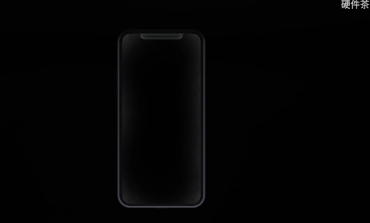
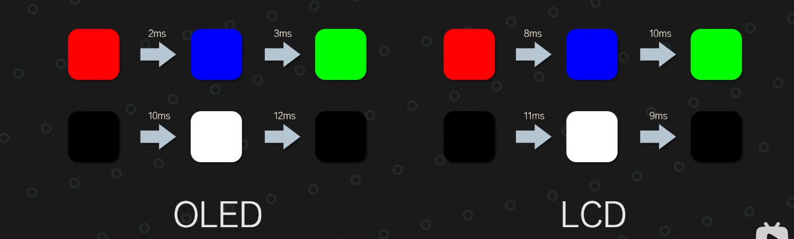
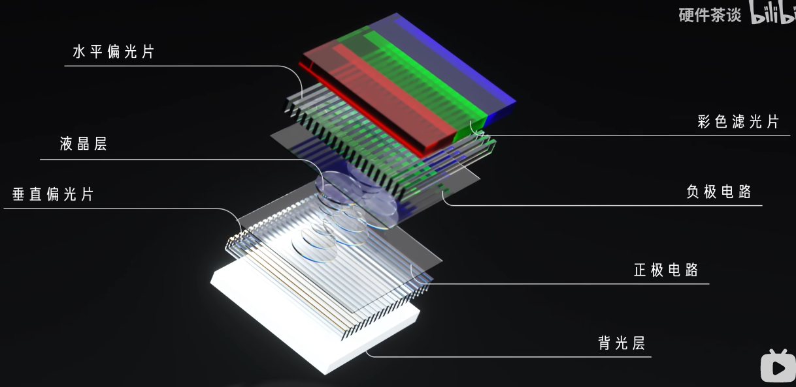
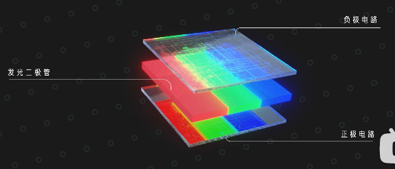

# 基础知识  
- 对比度：画面黑白明暗的亮度比值，对比度越高，色彩越鲜艳。  
- 熄屏显示：关闭某些像素点，以低亮度和低刷新率显示部分重要信息  
- 老化/烧屏：
- 漏光：LCD有背光层，屏幕与边框的衔接处背光层的背光和容易漏出去，在显示黑色画面时边框有白色光晕。    
- 屏幕响应时间：像素点在不同颜色间的切换时间，响应时间过长会导致残影的出现  
  
- 

# LCD  
  
**整个屏幕共享一个背光板（LED发射白光）**  
工作原理：通过控制电压的大小，改变液晶分子的偏转角度，改变RGB三色亮度，进而改变颜色  
优点：  
1.
缺点：  
1.不能显示纯正的黑色（只能显示灰色），对比度低，液晶分子无法完全闭合。  
2.不能做熄屏显示，共用一个背光板。  
3.响应时间：液晶分子在低温下的偏转速度下降，响应时间较长。  
# OLED  
  
**有机发光二极管，每个像素点独立控制开关**  
工作原理：通过控制电压，直接控制二极管发光度  
优点：  
1.可以做熄屏显示（**关闭某些像素点（LCD不能）**，以低亮度和低刷新率显示部分重要信息）  
2.近乎无限的对比度。  
3.无漏光  
4.响应时间短。  
6.屏幕简单，较薄。  

5.

缺点：  
1.

