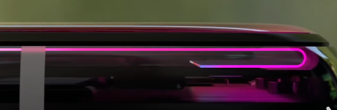
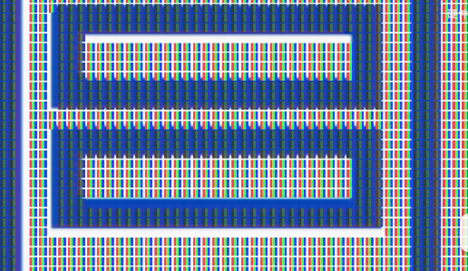

# 基础知识  
## 对比度：  
画面黑白明暗的亮度比值，对比度越高，色彩越鲜艳。  
## 熄屏显示：  
关闭某些像素点，以低亮度和低刷新率显示部分重要信息  
## 老化/烧屏：  
像素点老化不均匀导致的屏幕色差。  
## 漏光：  
LCD有背光层，屏幕与边框的衔接处背光层的背光和容易漏出去，在显示黑色画面时边框有白色光晕。
   
## 屏幕响应时间：  
像素点在不同颜色间的切换时间，响应时间过长会导致残影的出现  
  
## 屏幕封装：  
### 传统COG：  
  
### COF（非旗舰安卓机器常用）：  
  
### 旗舰COP(全面屏)：  
  
  
**屏幕弯折过大，良品率低；屏幕有一部分浪费**  
## 调光方式（调整亮度）  
   
### DC：直接控制电压改变亮度，但蓝光占比多，伤眼。  
### PWM：控制屏幕打开关闭的比例来控制亮度。（频闪伤眼，PWM频率越高，伤害越小），蓝光占比小（技术调整下）    
  
## PPI：  
屏幕分辨率  300够用，360清晰，420锐利  
### RGB排列的LCD：  
  
## 子像素排列方式  
### RGB排列：  
  
### AMOLED/RGBG排列（Pentile钻石排列）（AM是ACTIVE-MATRIX动态矩阵，是像素寻址技术）：  
  
    
pentitle排列原因：  
1.像素点种植成本。  2.红绿蓝像素老化速度不一样，可帮助让老化更均匀

## micro OLED  
把LCD的背光板改为独立的LED灯珠（无机），但像素点种植成本高  
  
## mini LED背光  
将LCD的一整块背光板分割，在一定范围内提高局部对比度，但在小范围的高亮图像时（如鼠标），在边缘会有明显的光晕，并且厚度大，发热严重。  
##  补充  
电脑和电视上的IPS，TN还有VA都是属于LCD屏幕，他们的区别就是液晶层结构不同，TN可以是实现很快的偏转速度但是色彩比较差，VA可以实现很高的对比度但是响应速度很慢，IPS对比度虽然没有VA那么高但是色彩也还不错，响应时间介于VA和TN，比较适中，所以IPS的综合体验是最好的，这也就是为什么买电脑都推荐买IPS面板的屏幕。  

三星还有一种屏幕技术叫QLED，全称叫量子点背光，他也是一种LCD屏幕，只不过对传统的LED背光进行了改良，更换了亮度和发光度更好的量子点发光管，实现更好的色域和对比度，但是其本质还是LCD屏幕，也有液晶层和背光层，所以还是具有节目里说的那些缺憾。  

# LCD  
  
**整个屏幕共享一个背光板（LED发射白光）**  
工作原理：通过控制电压的大小，改变液晶分子的偏转角度，改变RGB三色亮度，进而改变颜色  
优点：  
1.屏幕老化时整个背光层一起老化，肉眼不易辨别。  
缺点：  
1.不能显示纯正的黑色（只能显示灰色），对比度低，液晶分子无法完全闭合。  
2.不能做熄屏显示，共用一个背光板。  
3.响应时间：液晶分子在低温下的偏转速度下降，响应时间较长。  
4.背光层和液晶层是硬质基材，只能小幅度弯折（桌面显示器）。

# OLED（）三星、京东方主要供货）  
  
**有机发光二极管，每个像素点独立控制开关**  
工作原理：通过控制电压，直接控制二极管发光度  
优点：  
1.可以做熄屏显示（**关闭某些像素点（LCD不能）**，以低亮度和低刷新率显示部分重要信息）  
2.近乎无限的对比度。  
3.无漏光  
4.响应时间短。  
6.屏幕简单，较薄。  
7.可以大幅度弯折。（折叠屏、曲面屏）  
8.白色画面下OLED耗电 > LCD，日常使用时OLED耗电 < LCD。  
缺点：  
1.寿命短（有机自发光二极管）  
2.像素点独立发光，老化程度不同，肉眼易辨别  
3.无法使用DC调光（如果使用DC，亮度较低时会出现抹布一般不均匀的效果；存在类DC调光） 
 有机材料易老化，无法使用高频PWM  
4.理论清晰度达不到理论分辨率（PPI计算）。

